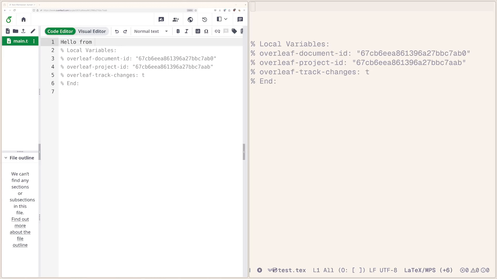

# Overleaf.el


<!-- MELPA badge image. -->
[](https://melpa.org/#/overleaf)

This package provides `overleaf-mode` that allows to
live-edit $\LaTeX{}$ files on [overleaf](https://github.com/overleaf/overleaf). Changes made offline can be synced to overleaf using `ediff`.

**Simultaneous edits from multiple sources are now supported but probably not entirely bug free. However, the worst thing that can happen is that people on overleaf might get an "out of sync" message and have to reload the page.**

_Note that active development happens on the `dev` branch._ Changes are rebased into `main` if they're unlikely to break things too badly. If you want to use the most "stable" version, the tagged versions (c.f. MELPA stable) are the place to go.

## Demo


## Installation
To use this package, you can clone the repo, make it available in you
load path and `(require 'overleaf)`. You can also use
`use-package`:
```elisp
  (use-package overleaf
    :custom
    (overleaf-use-nerdfont t "Use nerd-font icons for the modeline.")
    :config
    ;; Example: load/save cookies from GPG encrypted file.
    ;;          (remove the .gpg extension to save unencrypted)
    (let ((cookie-file "/home/user/.overleaf-cookies.gpg"))
      (setq overleaf-save-cookies
            (overleaf-save-cookies-to-file cookie-file))
      (setq overleaf-cookies
            (overleaf-read-cookies-from-file cookie-file)))

    ;; Example: load cookies from firefox
    (setq overleaf-cookies
          (overleaf-read-cookies-from-firefox :profile "[YOUR PROFILE].default")))
```

## Setting Up
### Getting the Session Cookies
First, there are the session cookies which can be obtained either
through executing the command `M-x overleaf-authenticate`, reading the
Firefox cookie database or through the developer tools in your
favorite browser.

#### `overleaf-authenticate`
For the former option the [Mozilla gecko driver](https://github.com/mozilla/geckodriver) must be installed and
the variable `overleaf-save-cookies` must be set to a function that
receives a string containing the cookies and saving it either directly
into `overleaf-cookies` via `setq` (that's the default) or stores it by
some other means. In the latter case the variable `overleaf-cookies`
must be assigned a function that returns the cookie string. For
example, the cookies can be stored and loaded from a `gpg` encrypted
file:
```elisp
  (let ((cookie-file "/home/user/.overleaf-cookies.gpg"))
      (setq overleaf-save-cookies
            (overleaf-save-cookies-to-file cookie-file))
      (setq overleaf-cookies
            (overleaf-read-cookies-from-file cookie-file)))
```

#### Firefox
Locate your Firefox profile folder and set:
```emacs-lisp
(setq overleaf-cookies
      (overleaf-read-cookies-from-firefox
       [optional: :firefox-folder "<firefox-folder>"]
       [optional: :profile "<profile>"]))
```
This assumes that you're logged into overleaf in this Firefox profile.
On GNU/Linux, the default `<firefox-folder>` is typically `/home/user/.mozilla/firefox/`.
On macOS, `<firefox-folder>` is typically `/Users/user/Library/Application Support/Firefox`.

**It is recommended that no Firefox instance using this profile is running while
`overleaf.el` is accessing the cookie database. The cookies usually tend to be evicted from the database while Firefox is running and will only be put back upon closure.**

#### Manual
If the above doesn't work for you, simply open the overleaf document
you want to edit and enable network monitoring. Select any request
made to the overleaf domain and get the contents of the `Cookie` request
header. It should have contents like:
```text
  overleaf_session2=[redacted]
```

Then set `overleaf-cookies` to the cookies string
```elisp
  (setq overleaf-cookies
        (("[overleaf domain (e.g. overleaf.com)]" "overleaf_session2=[session]" [expiry unix time])))
```
or store the cookies by any means you'd like (see above) and set
`overleaf-cookies` to a function that returns the cookie string. The
domain can be given at any level of specificity, from the full host
(e.g. `www.overleaf.com`) down to just the registrable domain
(e.g. `overleaf.com`) — all levels are tried when looking up the
cookies.


## Usage
If the cookies are set, calling `overleaf-connect` will prompt you for a
project and file to connect to if the buffer has never been connected to overleaf.
If you want to reconnect the same buffer forcibly to another overleaf document, use `overleaf-find-file`.

If this buffer hasn't been associated
with an overleaf connection before (i.e.
the `document-id` and `project-id` aren't set), use `M-x overleaf-find-file`
to select a project and file.

The default overleaf instance can be customized by changing the `overleaf-default-url`
variable.

Calling `overleaf-toggle-track-changes` toggles whether the edits made
in emacs will tracked (highlighted) by overleaf.

Calling `overleaf-disconnect` disconnects the current buffer from overleaf.

The modeline will indicate the connection status, as well as the
number of changes that have yet to be synced to overleaf and whether the track-changes feature is enabled: `(O: <connection status>, <number of changes>, <track changes status>)`.

Calling `overleaf-toggle-auto-save` toggles auto-saving the buffer whenever a consistent state with overleaf is reached.

With `overleaf-goto-cursor` one can jump to the cursor of another user.

Calling `overleaf-browse-project` opens a browser window with the current project.

### Nicer modeline icons
If you have a font with nerd-font symbol support you can set:
```emacs-lisp
    (setopt overleaf-use-nerdfont t)
```


### Conflict Resolution and 3-Way Merging
When reconnecting a buffer that has local changes not yet synced to Overleaf, the package will detect the discrepancy and prompt you to "Resolve conflicts with ediff?".

To make conflict resolution more efficient, `overleaf.el` supports *3-way merging*. It achieves this by automatically saving a hidden "ancestor" backup of your document whenever you disconnect. When a conflict occurs later, this ancestor is used as a common base to automate the merge of non-overlapping changes.

The location of these ancestor backups can be customized via the `overleaf-ancestor-location` variable:
- `'local` (Default): Saves a hidden file in the same directory as the document (e.g., `.filename.overleaf-ancestor`).
- `'centralized`: Saves all ancestor backups in a dedicated directory at `/home/user/.emacs.d/overleaf-ancestors/`.


### Keybindings
To make Overleaf keybindings available in LaTeX buffers, bind a key to `overleaf-command-map`, like so:

- For the built-in `tex-mode`:

```elisp
(with-eval-after-load 'tex-mode
  (keymap-set latex-mode-map "C-c o" overleaf-command-map))
```

- For [AUCTeX](https://www.gnu.org/software/auctex/manual/auctex/Installation.html#Installation):

```elisp
(with-eval-after-load 'latex
  (keymap-set LaTeX-mode-map "C-c o" overleaf-command-map))
```

- For `bibtex-mode`:

```elisp
(with-eval-after-load 'bibtex
    (keymap-set bibtex-mode-map "C-c o" overleaf-command-map))
```

The available keybindings are then:
  - `[prefix] c` - (re)-connect
  - `[prefix] d` - disconnect
  - `[prefix] t` - toggle track-changes
  - `[prefix] s` - toggle auto-save
  - `[prefix] b` - browse project
  - `[prefix] f` - find file
  - `[prefix] g` - go to the cursor of another user
  - `[prefix] l` - list users' cursor positions in an xref buffer


## Troubleshooting
Rather verbose logging may be enabled by setting `overleaf-debug` to `t`.
The log message will be collected in a buffer `*overleaf-[document-id]*`.

Feel free to open an issue providing this log.

## Alternatives
- [GhostText](https://github.com/fregante/GhostText) works pretty well in conjunction with [Atomic Chrome](https://github.com/alpha22jp/atomic-chrome)

  Had I realized this solution existed, I probably wouldn't have started this project. However, the solution here is still useful and provides some functionality on top (like jumping to other peoples cursors).


## To-do
- [ ] work out edge case: receiving changes while still decoding doc
- [ ] store project and document names in buffer-locals
